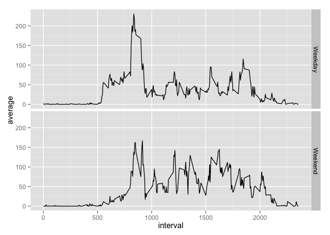

# Reproducible Research: Peer Assessment 1
Michael Park  


## Loading and preprocessing the data
First, we need to get the data from the course website. The code below will install the packages we will need for this project, download the zip file to the working directory, unzip it, and load the unzipped data. It will also convert the date variable from character class into Date class.


```r
library(plyr)
library(ggplot2)
download.file("http://d396qusza40orc.cloudfront.net/repdata%2Fdata%2Factivity.zip", "activity.zip")
unzip("activity.zip")
activity <- read.csv("activity.csv", header = TRUE, stringsAsFactors = FALSE)
activity[,2]<-as.Date(activity[,2])
```

## What is mean total number of steps taken per day?
Later we will attempt to adjust for the missing values, but for the moment we will ignore them and compute the daily sums based on the measurements we do have.


```r
dailysum <- ddply(activity, "date", summarise, perday = sum(steps, na.rm = TRUE))
hist(dailysum[,2], xlab = "Steps per day", main = "")
```

 

```r
mean(dailysum[,2])
```

```
## [1] 9354.23
```

```r
median(dailysum[,2])
```

```
## [1] 10395
```

## What is the average daily activity pattern?

```r
intmean <- ddply(activity, "interval", summarise, perint = mean(steps, na.rm = TRUE))  
plot1 <- ggplot(intmean, aes(interval, perint))+geom_line()
plot1
```

 

```r
intmean[which.max(intmean[,2]),1]  
```

```
## [1] 835
```
## Imputing missing values
Now to return to the issue of missing values. The simplest method for compensating would be to substitute in the daily average value for any missing value. There are two issues with this strategy. First, the number of steps taken can vary greatly between times of day. Secondly, for any day with no recorded measurements at all, we would have no value to insert. The best balance between accuracy and simplicity of calculation seems to be to use the corresponding five minute interval average as a substitute for any missing values. 


```r
sum(is.na(activity[,1])) #finds the total number of NA values
```

```
## [1] 2304
```

```r
nalist <- unlist (lapply (activity, function (x) which (is.na (x)))) #gets the indices of all of the NA values
intlist <- rep(intmean$perint, 61) 
adjusted <- activity
for (i in 1:length(nalist)){
  adjusted[nalist[i],1] <- intlist[i]
}
adjsum <- ddply(adjusted, "date", summarise, perday = sum(steps))
hist(adjsum[,2], xlab = "Steps per day", main = "")
```

 

```r
mean(adjsum[,2])
```

```
## [1] 10766.19
```

```r
median(adjsum[,2])
```

```
## [1] 10766.19
```
Approximately 13% of the observations were missing. By replacing them with average values instead of treating them as zeros, this moved many of the daily totals, as well as the adjusted mean and median, much closer to the previous median value. The fact that the mean and the median are the same to two decimal places is not particularly surprising, since the data is now much closer to being a normal distribution.

## Are there differences in activity patterns between weekdays and weekends?

```r
day <- weekdays(adjusted[,2])
for (i in 1:length(day)){
  if (day[i] == "Saturday" |day[i] == "Sunday"){
    day[i] <- "Weekend"
  } else day[i] <- "Weekday"
}
adjusted$day<- as.factor(day)
adjusted[which(adjusted$day == "Weekday"),5] <- unlist(daply(subset(adjusted, day == "Weekday"), "interval", summarise, 
                  perint = mean(steps)))
adjusted[which(adjusted$day == "Weekend"),5] <- unlist(daply(subset(adjusted, day == "Weekend"), "interval", summarise, 
                  perint = mean(steps)))
names(adjusted)[5] <- "average"
plot2 <- ggplot(adjusted, aes(interval, average))+geom_line()
plot2 + facet_grid(day~.)
```

 
